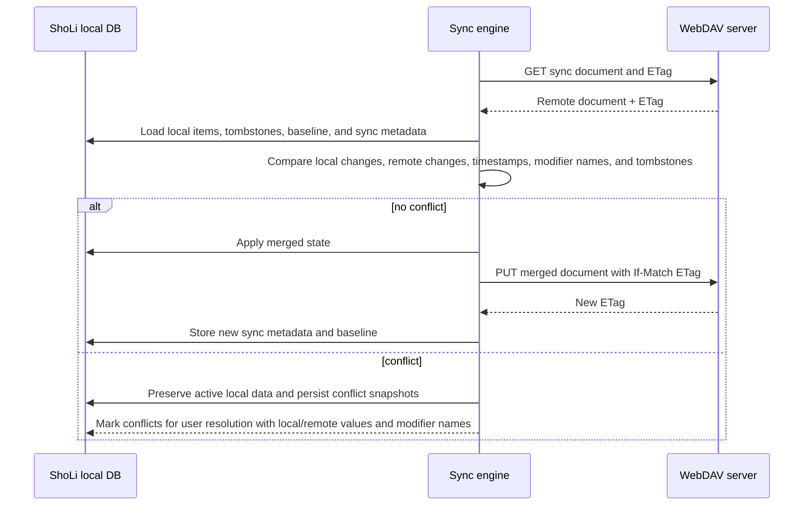

# Epic #13 — WebDAV synchronization with safe conflict resolution

Status: draft

## Description

# WebDAV synchronization with safe conflict resolution

## Context
ShoLi is an offline-first Android application for maintaining short shopping-style lists. The current data model stores items locally in SQLite through greenDAO with only an item name and status. Users who use ShoLi on multiple devices currently have no built-in way to keep those devices synchronized.

## Problem
Users want to synchronize their ShoLi list through a WebDAV-compatible server such as Nextcloud or DAViCal. Synchronization must be safe when two devices edit the list concurrently. The application must not silently overwrite local or remote changes, especially when a synchronization occurs after another device has already pushed modifications online.

## Scope
This epic adds the foundations and user-facing behavior needed for WebDAV synchronization:

- local sync metadata for stable item identity via a stored `sync_id`, local modification timestamps, modifier names, deletion tracking, and sync bookkeeping
- deterministic initial `sync_id` assignment from canonical item names so two devices that concurrently create the same item converge to the same identity
- immutable stored `sync_id` values after creation/migration/import so identity remains stable across renames, status changes, deletion, conflict resolution, imports, reordering, and offline edits
- a canonical remote full-snapshot JSON document format that preserves item identity, item values, timestamps, modifier names, and tombstones across devices
- settings for WebDAV server URL, username, encrypted password/app token, remote file path, and user-visible device/user display name
- Android API 23+ as the minimum for the sync-capable release, enabling AndroidX Security `EncryptedSharedPreferences` backed by Android Keystore
- WebDAV upload/download behavior using server-provided ETags and conditional writes when available
- automatic merging for non-conflicting local and remote edits using a last-successful-sync baseline
- explicit per-item conflict resolution when the same semantic item field changed locally and remotely after the last successful sync

## Non-goals
The first implementation does not attempt to provide real-time collaboration, background scheduling, multi-user sharing semantics, or support for arbitrary cloud providers beyond WebDAV. It also does not require adding multiple named list support unless that capability already exists in ShoLi. It does not add an insecure plaintext credential fallback for Android versions below API 23.

## Constraints
The sync-capable ShoLi release raises `minSdkVersion` to Android 6.0/API 23. Devices running Android API 14 through 22 remain on the previous non-sync-capable release if distribution channels support keeping that APK available. The implementation should fit the current Java/greenDAO architecture where practical, while allowing the dependency updates required for AndroidX Security. Existing data on supported devices must be preserved during database migration. Network behavior must fail safely when offline, when credentials are invalid, when encrypted credential storage is unavailable, or when remote state has changed unexpectedly.

## Desired Outcome
A user can configure a WebDAV remote, synchronize local and remote list state, safely merge independent changes, and resolve conflicts when concurrent edits target the same item. Conflict screens show both versions, timestamps, and the device/user names that made each change. Local data remains usable offline and is never silently discarded during synchronization.

## Suggested workflow

## Acceptance Criteria

1. Given a ShoLi user has multiple Android devices using the same WebDAV sync configuration  
   When they synchronize after edits were made on one device only  
   Then the edited list state is propagated without duplicating items or losing item status

2. Given local and remote list state changed independently since the previous successful sync  
   When synchronization runs  
   Then non-conflicting item changes are merged automatically and both sides converge to the merged state

3. Given the same item changed locally and remotely since the previous successful sync  
   When synchronization runs  
   Then ShoLi detects the conflict and does not overwrite either side without user choice

4. Given the WebDAV server exposes an ETag for the remote sync document  
   When ShoLi uploads a changed document  
   Then ShoLi uses conditional upload semantics so a concurrently changed remote document is not overwritten

5. Given an existing ShoLi installation on a supported Android API 23+ device is upgraded to the sync-capable schema  
   When the user opens the app after upgrade  
   Then all existing list items remain available and receive the metadata required for future synchronization

6. Given network access, authentication, or remote document parsing fails during synchronization  
   When ShoLi cannot complete a safe sync  
   Then local data remains unchanged and the user receives a clear failure state

7. Given the sync-capable ShoLi release stores WebDAV credentials  
   When credentials are persisted for later synchronization  
   Then secret material is stored with AndroidX Security encrypted storage on API 23+ and is never stored in plaintext sync metadata, logs, exports, or error messages

## Linked Stories

- #1 — Add local synchronization metadata to ShoLi items `[accepted]` `[must]`
- #2 — Define canonical JSON sync document for ShoLi lists `[accepted]` `[must]`
- #3 — Configure and test a WebDAV synchronization endpoint `[accepted]` `[must]`
- #4 — Upload and download ShoLi sync documents through WebDAV using ETags `[accepted]` `[must]`
- #5 — Merge non-conflicting local and remote list changes `[accepted]` `[must]`
- #6 — Resolve conflicting concurrent item changes during synchronization `[accepted]` `[must]`
- #7 — Raise minimum Android version for secure WebDAV credential storage `[accepted]` `[must]`
